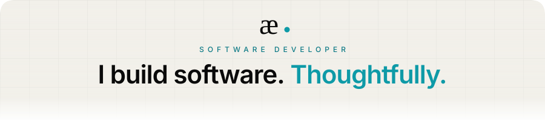

  

  <a href="https://andyechc.is-a.dev"><picture><source media="(prefers-color-scheme: dark)" srcset="assets/pill-portfolio.svg" /></picture></a>
  <a href="https://x.com/andyechc"><picture><source media="(prefers-color-scheme: dark)" srcset="assets/pill-x.svg" /></picture></a>
  <a href="mailto:andyechc@gmail.com"><picture><source media="(prefers-color-scheme: dark)" srcset="assets/pill-email.svg" /></picture></a>

 

I work across web, backend and mobile. My interest is in <b>interfaces that stay out of the way</b>, <b>architectures that hold up</b>, and <b>details that make software feel finished</b>.

 

Over the years I have moved from freelance web work to full-stack platforms and now to cross-platform mobile. Along the way I have picked up <b>payment integrations</b> and <b>security-sensitive flows</b>, <b>realtime communication</b> over protocols like <code>JSON-RPC</code>, and shared networking layers in <code>Kotlin Multiplatform</code> for Android and iOS from a single codebase. I have also built <b>native desktop software</b>, <b>terminal utilities</b> and media pipelines, <b>business systems</b> with <code>REST APIs</code> and database architecture behind them, and <b>web products</b> ranging from landing pages to complete platforms.

The technical depth lives in my <a href="https://andyechc.is-a.dev">portfolio</a>.

 

  
  

 

  
    
  Built with curiosity.

